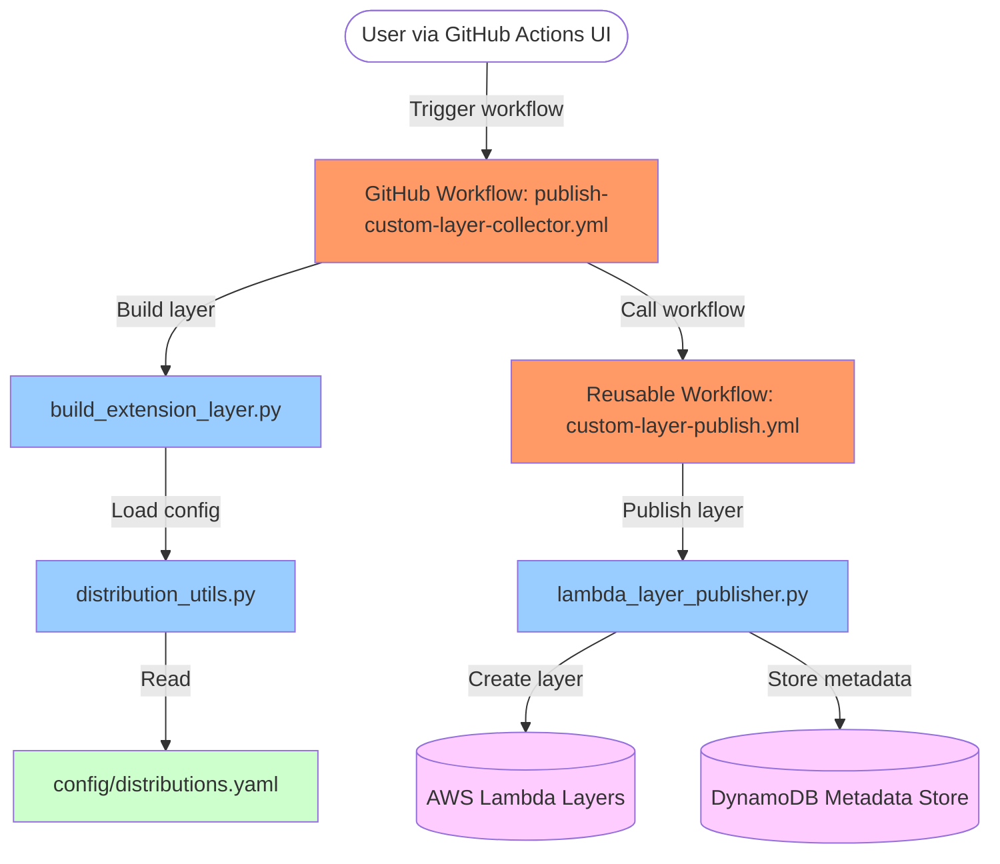
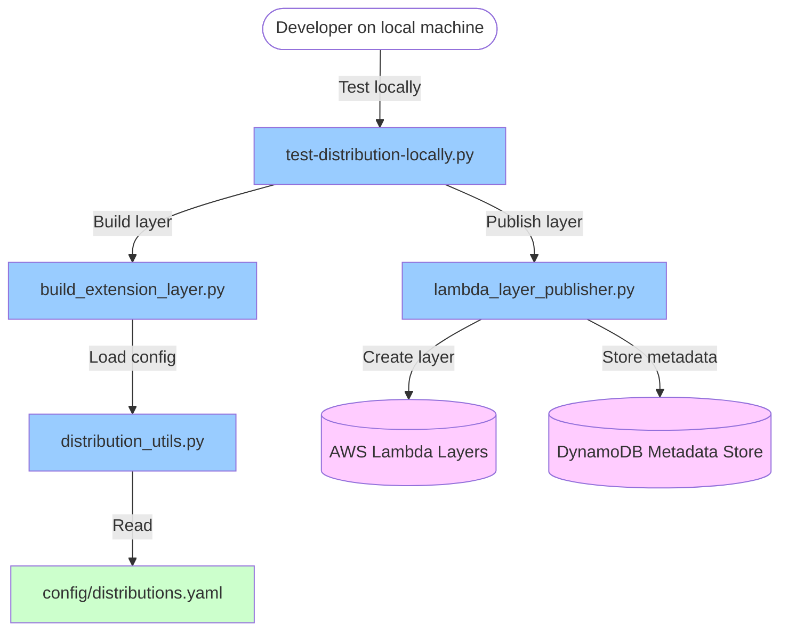

# Custom OpenTelemetry Collector Lambda Layers

This repository contains customizations for OpenTelemetry Collector Lambda Layers, building upon the [OpenTelemetry Lambda](https://github.com/open-telemetry/opentelemetry-lambda) project. It uses an "overlay" approach to maintain custom components while staying in sync with upstream changes.

## Overview

Instead of maintaining a direct fork of the OpenTelemetry Lambda repository (which would lead to complex merge conflicts), this repository contains only custom components and workflow definitions. During the build process, it:

1. Clones the upstream OpenTelemetry Lambda repository
2. Overlays our custom components on top
3. Builds and publishes custom Lambda layers with the extended functionality

This approach allows us to stay current with upstream changes while maintaining our custom integrations.

## Custom Components

Currently, the repository includes the following custom components:

- **ClickHouse Exporter**: Exports telemetry data to ClickHouse databases ([documentation](docs/clickhouse.md))

## Available Distributions

This repository can build several predefined distributions:

- `default`: Standard OpenTelemetry Collector with receivers, exporters, processors, and extensions (but no connectors)
- `minimal`: A minimal distribution with just OTLP receivers and batch processors
- `clickhouse`: Distribution with ClickHouse exporter capabilities (inherits from `minimal`)
- `full`: Complete distribution with all available components (superset of `default` that also includes connectors and custom components)

Distributions can now inherit build tags from a `base` distribution, simplifying configuration (see `config/distributions.yaml`). Only predefined distributions from this file can be built.

## Understanding Distributions

When running the "Publish Custom Collector Lambda layer" workflow, the **Distribution** option determines which set of OpenTelemetry Collector components are included in the layer. Here's a breakdown of what each option provides:

| Distribution          | Included Components / Build Tags                                                                                                | Description                                                                 |
| :-------------------- | :------------------------------------------------------------------------------------------------------------------------------ | :-------------------------------------------------------------------------- |
| `default`             | *(Upstream Default)* Standard receivers, processors, exporters, extensions                                                      | The standard set of components provided by the upstream OpenTelemetry Lambda. Does not include any connectors. |
| `minimal`             | `lambdacomponents.custom`, OTLP Receiver, Batch Processor                                                                       | A lightweight layer with only essential OTLP receiving and batching.        |
| `clickhouse`          | `lambdacomponents.custom`, OTLP Receiver, Batch Processor, **ClickHouse Exporter**                                              | Includes the custom ClickHouse exporter for sending data to ClickHouse.     |
| `clickhouse-otlphttp` | `lambdacomponents.custom`, OTLP Receiver, Batch Processor, **ClickHouse Exporter**, **OTLP/HTTP Exporter**                       | Includes both the ClickHouse and standard OTLP/HTTP exporters.              |
| `full`                | `lambdacomponents.custom`, `lambdacomponents.all` (All custom *and* upstream components)                                        | A comprehensive layer including all available upstream and custom components. Effectively a superset of `default` that also includes connectors like `spanmetrics`. |

**Note:** All distributions except `default` automatically include the `lambdacomponents.custom` build tag, which is necessary for enabling the custom component overlay mechanism. Distributions can also define a `base` distribution in `config/distributions.yaml` to inherit build tags from; the final tag set is the unique combination of the base tags and the distribution's specific tags. Refer to the Go files in the `components/` directory and the upstream repository for details on available component tags.

## Upstream Default Components

The `default` distribution uses the standard component set provided by the upstream OpenTelemetry Lambda repository when no custom build tags are specified. This includes:

*   **Receivers:**
    *   `otlp`: OTLP gRPC/HTTP receiver.
    *   `telemetryapi`: AWS Lambda Telemetry API receiver.
*   **Exporters:**
    *   `debug`: Logs telemetry data to the console.
    *   `otlp`: OTLP gRPC exporter.
    *   `otlphttp`: OTLP HTTP exporter.
    *   `prometheusremotewrite`: Prometheus Remote Write exporter.
*   **Processors:**
    *   `attributes`: Modifies attributes based on rules.
    *   `filter`: Filters telemetry data based on criteria.
    *   `memory_limiter`: Prevents excessive memory usage.
    *   `probabilistic_sampler`: Samples traces probabilistically.
    *   `resource`: Modifies resource attributes.
    *   `span`: Modifies span attributes.
    *   `coldstart`: Detects Lambda cold starts (Lambda specific).
    *   `decouple`: Decouples pipeline processing for better Lambda performance (Lambda specific).
    *   `batch`: Batches telemetry data before export.
*   **Extensions:**
    *   `sigv4auth`: Provides AWS SigV4 authentication for exporters.
    *   `basicauth`: Provides Basic HTTP authentication for exporters/receivers.
*   **Connectors:**
    *   None. The default distribution does not include any connectors.

**Note:** The `full` distribution includes all of the above components, plus connectors like `spanmetrics` and any custom components defined in this repository.

For detailed configuration options of these components, please refer to the upstream [OpenTelemetry Lambda](https://github.com/open-telemetry/opentelemetry-lambda) and [OpenTelemetry Collector Contrib](https://github.com/open-telemetry/opentelemetry-collector-contrib) documentation.

## Detailed Component Comparison: Default vs Full Builds

The following tables provide a detailed comparison of components included in the `default` and `full` distributions:

### Connectors

| Component Name | Default Build | Full Build |
|---------------|--------------|------------|
| spanmetrics |   | ✓ |

### Exporters

| Component Name | Default Build | Full Build |
|---------------|--------------|------------|
| debug | ✓ | ✓ |
| otlp | ✓ | ✓ |
| otlphttp | ✓ | ✓ |
| prometheusremotewrite | ✓ | ✓ |

### Extensions

| Component Name | Default Build | Full Build |
|---------------|--------------|------------|
| basicauth | ✓ | ✓ |
| sigv4auth | ✓ | ✓ |

### Processors

| Component Name | Default Build | Full Build |
|---------------|--------------|------------|
| attributes | ✓ | ✓ |
| batch | ✓ | ✓ |
| coldstart | ✓ | ✓ |
| decouple | ✓ | ✓ |
| filter | ✓ | ✓ |
| memorylimiter | ✓ | ✓ |
| probabilisticsampler | ✓ | ✓ |
| resource | ✓ | ✓ |
| span | ✓ | ✓ |

### Receivers

| Component Name | Default Build | Full Build |
|---------------|--------------|------------|
| otlp | ✓ | ✓ |
| telemetryapi | ✓ | ✓ |

As shown above, the key difference is that the `full` distribution includes additional connector components that are not available in the `default` distribution.

## Usage

### Publishing a Custom Layer

1. Navigate to the "Actions" tab in the GitHub repository
2. Select the "Publish Custom Collector Lambda layer" workflow
3. Click "Run workflow" and configure the options:
   - **Architecture**: Choose between `all`, `amd64`, or `arm64`
   - **AWS Region**: Select the AWS region(s) for publishing
   - **Distribution**: Select a predefined component set from `config/distributions.yaml`
   - **Upstream Repo**: Repository to clone (default: `open-telemetry/opentelemetry-lambda`)
   - **Upstream Ref**: Git reference to use (branch, tag, commit SHA)

### Adding New Custom Components and Distributions

**Adding a New Custom Go Component:**

If you are adding entirely new functionality (like a new exporter or processor):

1.  Create the corresponding `.go` file in the appropriate `components/collector/lambdacomponents/{component-type}/` directory (e.g., `exporter`, `processor`).
2.  Add the standard Go build tags at the top of the file to control its inclusion:
    ```go
    //go:build lambdacomponents.custom && (lambdacomponents.all || lambdacomponents.{component-type}.all || lambdacomponents.{component-type}.{component-name})
    ```
    Replace `{component-type}` and `{component-name}` accordingly (e.g., `lambdacomponents.exporter.myexporter`).
3.  Add documentation for your new component in the `docs/` directory.
4.  Update the "Custom Components" section of this README.md.

**Defining a New Distribution Preset:**

If you want to create a new named option in the "Distribution" dropdown that combines existing upstream or custom components using specific build tags:

1.  Edit the `config/distributions.yaml` file.
2.  Add a new top-level key with your desired distribution name (e.g., `my-custom-dist`).
3.  Define the `description` and the list of `buildtags` required for this distribution. Remember to include `lambdacomponents.custom` if you are including any custom components or deviating from the upstream default.
    ```yaml
    my-base-dist:
      description: "A base set of components"
      buildtags:
        - lambdacomponents.custom
        - lambdacomponents.receiver.otlp
        - lambdacomponents.processor.batch

    my-custom-dist:
      description: "Inherits from base and adds myexporter"
      base: my-base-dist # Optional: Inherit tags from another distribution
      buildtags:
        # Only list tags *not* already in the base
        - lambdacomponents.exporter.myexporter 
    ```
    If `base` is specified, the `buildtags` from the base distribution are automatically included. The final set of tags will be the unique combination of the base tags and the tags listed directly under `buildtags` for the current distribution.
4.  Manually edit `.github/workflows/publish-custom-layer-collector.yml` and add your new distribution name (`my-custom-dist`) to the `options` list under `on.workflow_dispatch.inputs.distribution`. This makes it selectable in the GitHub Actions UI dropdown.
5.  Update the "Available Distributions" list and the "Understanding Distributions" table in this README.md to include your new distribution preset.

See `docs/distribution-management.md` for more details on the refactored distribution management approach.

## Implementation Details

### Directory Structure

- `.github/workflows/`: GitHub Actions workflow definitions
- `components/collector/lambdacomponents/{component-type}/{component-name}.go``: Custom components to overlay onto the upstream repo, following the directory structure of the upstream
- `docs/`: Documentation for custom components and various implementation plans

### Workflow Architecture

The custom layers are built using a two-workflow approach:

1. **Publish Custom Collector Lambda layer**: Main workflow that:
   - Clones the upstream repository
   - Overlays custom components
   - Builds the collector with specified build tags
   - Uploads the resulting artifacts
   - Triggers the layer publishing process

2. **Custom Publish Lambda Layer**: Reusable workflow that:
   - Constructs the layer name based on inputs
   - Downloads the built layer artifact
   - Publishes the layer to AWS Lambda
   - Makes the layer public

## Architecture Diagram

The following diagram illustrates the caller flow and dependencies in this project:



### Local Development Workflow

For local development and testing, the workflow is simplified:



This diagram shows:

1. **User Flows**:
   - GitHub Actions UI for production layer publishing (inputs: architecture, AWS region, distribution, and making the layer public)
   - Local development for testing and maintenance

2. **Script Dependencies**:
   - How the build script uses distribution utilities
   - How the publishing script interacts with AWS resources

3. **Data Flow**:
   - Configuration through distributions.yaml
   - Artifact building and publishing processes
   - Metadata storage in DynamoDB

4. **Process Steps**:
   - The main GitHub workflow prepares matrices for build and release
   - The reusable workflow downloads artifacts and invokes the publishing script with environment variables
   - Local testing uses the same underlying scripts but with different parameters

The architecture follows a modular design where each component has a specific responsibility, making it easy to maintain and extend.

## License

This project is licensed under the MIT License - see the LICENSE file for details.
